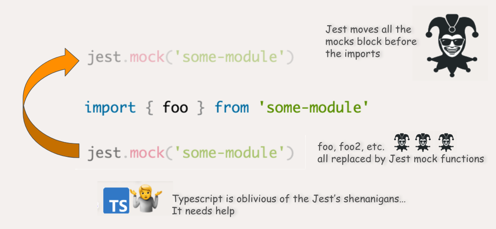

# Mock modules properly with Jest and Typescript

Jest provides a comprehensive suite of features designed to easily mock JavaScript modules.  
At its core lies a concept that many developers will struggle with, if they haven't read carefully the documentation: the hoisting of mocks.

This often leads to unecessary long and messy mock-related code, strange errors, and poor typings.  
This article exposes the best way to succinctly and efficiently mock an ESM module, with strong typings.

### How do I do it?

For the readers in a hurry, here you have it.

```ts
import { foo } from 'some-module' // Mocked module

jest.mock('some-module')

const mockFoo = jest.mocked(foo)
```

`jest.mocked()` is only avaivable in Jest v27+.  
For older versions of Jest, use the form below, which will work in any version of Jest with Typescript support.

```ts
import { foo } from 'some-module' // Mocked module

jest.mock('some-module')

const mockFoo = foo as jest.MockedFunction<typeof foo>
```

You can then ensure your mock is properly typed by using `mockReturnValue`

```ts
mockFoo.mockReturnValue(1) // Works
mockFoo.mockReturnValue('a') // Typescript error: foo must return a number
```

### Under the hood

Understanding what happens will prevent you some headaches in the future.

> Did you ever wonder why Jest is called like this?  
> While the authors did not state why this exact name why chosen, I like to think that it is because the framework likes to "mock" and do tricks. 🤡  
> In our example, Typescript is the victim.



- Jest processes the mocks definitions _before_ the imports.  
  This process is called **mock hoisting** and can be quite confusing at first.  
  🐨 Tips: I like to add the `// Mocked module` comment next to the mocked import, to make it obvious to everybody that we are dealing with a mocked module.

- `jest.mock` replaces all functions of the module by mock functions.  
  You therefore don't need to define those mocks by hands.  
  Thanks to _mock hoisting_, you can import them through the usual `import` keyword.

- You need to help Typescript.  
  Typescript does not know about Jest's hoisting shenanigans; and think the function is imported without alterations.  
  There are various ways to hint Typescript that the function is a mock, depending on your needs and your preferences.

```ts
// A bit verbose, but works everywhere.
const mockFoo = foo as jest.MockedFunction<typeof foo>

// Equivalent to the 1rst form.
// From jest 27+
const mockFoo = jest.mocked(foo)

// A less verbose form, but you won't benefit from typechecking when mocking the returned value. This sub-optimal formal is still widely seen in old codebases.
const mockFoo = foo as jest.Mock

// For one-time use, if you want to save a line not creating a variable.
jest.mocked(foo).toHaveBeenCalled()

// For one-time use 🤮
;(foo as jest.Mock).toHaveBeenCalled()
```

### Scope

In this article, in order to bring the focus on principles linked to writing and typing Jest mocks, the focus was on ESM modules, with exported named functions.
This is probably the most common form of modules that you'll encounter, when consuming a library.
Mocking CommonJs (`require`), default exports or classes could be covered in an future article.
